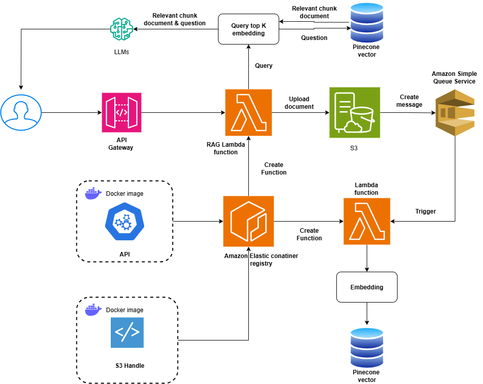

# Chat_rag: RAG Chatbot with document

## Tổng quan

Hệ thống RAG (Retrieval-Augmented Generation) sử dụng FastAPI, AWS Lambda, S3, SQS, Pinecone.

#
- **FastAPI**: API chính phục vụ truy vấn và Embedding document vào vector database.
- **AWS Lambda**: Deploy serverless cho FastAPI và SQS worker xử lý các tác vụ embedding document.
- **S3**: Lưu trữ tài liệu đầu vào.
- **SQS**: Hàng đợi xử lý tài liệu bất đồng bộ.
- **Pinecone**: Lưu trữ vector embedding cho tìm kiếm ngữ nghĩa.
- **ECR**: Lưu trữ conainer image. 
- **Docker**: Đóng gói và triển khai ứng dụng.
- **Terraform**: Quản lý hạ tầng AWS (API Gateway, Lambda, S3, SQS, IAM, ...).

## Cấu trúc thư mục
- `app/`         : Source FastAPI (main.py, api/routes.py)
- `modules/`     : Các module xử lý RAG
- `rag/`         : Pipeline, loader cho RAG
- `sqs_build/`   : Worker xử lý SQS (ví dụ: worker.py)
- `aws/`         : Terraform scripts, requirements, deploy script
- `Dockerfile`   : Docker build cho Lambda hoặc FastAPI

## Hướng dẫn sử dụng

### Đăng nhập AWS CLI
Trước khi build/push image hoặc deploy hạ tầng, bạn cần đăng nhập AWS CLI:

```sh
aws configure
# hoặc sử dụng AWS SSO nếu tổ chức bạn yêu cầu:
aws configure sso
```
Nhập các thông tin: AWS Access Key, Secret Key, Region, Output format theo hướng dẫn.


### 1. Cài đặt môi trường
- Python >= 3.10
- Docker >= 20.x
- AWS CLI, Terraform

### 2. Build hạ tầng bằng terraform (ECR Repo, S3, SQS)
```sh
cd aws
terraform init
terraform plan
terraform apply -target = module.infra 
```

### 2. Build & Deploy FastAPI Lambda bằng Docker
```sh
cd app
# Build và push image lên ECR,
bash deploy_lambda_ecr.sh
```
Update lambda nếu đã tạo
```sh
bash update_lambda.sh
```

### 3. Triển khai hạ tầng cho Lambda Container image và API Gateway cho FastAPI
Thêm biến môi trường vào variable.tf
```sh
- `PINECONE_API_KEY`, `PINECONE_ENV`, `PINECONE_INDEX`
- `AWS_ACCESS_KEY_ID`, `AWS_SECRET_ACCESS_KEY`, `AWS_REGION`
- `GOOGLE_API_KEY` (nếu dùng Google GenAI)
```
Build lambda
```sh
terraform apply -target = module.lambda
```

### 4. Build & Deploy SQS Worker Lambda bằng Docker
```sh
cd sqs_build
# Build và push image lên ECR,
bash deploy_sqs_worker_ecr.sh
```
Update lambda nếu đã tạo
```sh
bash update_lambda_worker.sh
```

### 5. Triển khai hạ tầng cho Lambda Container image và API Gateway cho SQS Worker
```sh
- `PINECONE_API_KEY`, `PINECONE_ENV`, `PINECONE_INDEX`
- `AWS_ACCESS_KEY_ID`, `AWS_SECRET_ACCESS_KEY`, `AWS_REGION`
- `GOOGLE_API_KEY` (nếu dùng Google GenAI)
```
Build lambda
```sh
terraform apply -target = module.sqs_lambda
```

## Sơ đồ hệ thống


